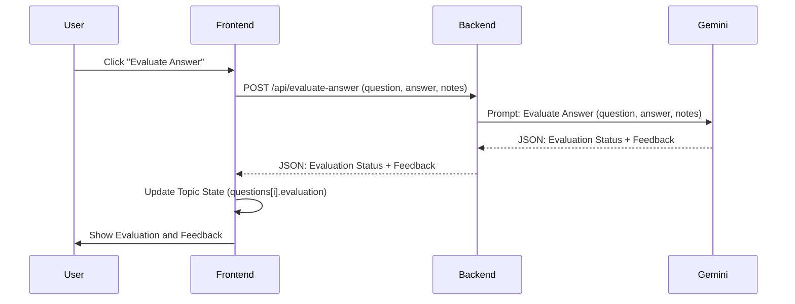

# AI Evaluation & Feedback Design

## Architecture Overview

The AI Evaluation & Feedback feature will compare a user's answer to the topic content and provide an assessment. This involves a new backend endpoint.

## Data Schema Updates

The `Evaluation` interface is already defined in the `AI Question Generator` design. This feature focuses on the implementation and storage of this object.

```typescript
export interface Evaluation {
  status: 'correct' | 'partial' | 'incorrect' | 'pending';
  feedback: string;
}
```

## API Contract

### `POST /api/evaluate-answer`

**Request Body:**
```json
{
  "question": "The text of the question?",
  "userAnswer": "The user's provided answer...",
  "notes": "Full topic notes...",
  "script": "AI-generated script (optional)..."
}
```

**Response Body:**
```json
{
  "evaluation": {
    "status": "correct | partial | incorrect",
    "feedback": "Detailed feedback explanation..."
  }
}
```

## AI Prompt Strategy (System Prompt for Gemini)

> "You are a specialized learning evaluator. Your task is to compare a student's answer to the provided study material and the question asked. Evaluate if the answer is 'correct', 'partial' (missing key points), or 'incorrect'. Provide a brief, constructive explanation of your evaluation. Return the response in a structured JSON format: { 'evaluation': { 'status': '...', 'feedback': '...' } }"

## UI Components

1. **EvaluationSection**: A section within the `QuestionCard` that appears after the user submits an answer.
2. **StatusBadge**: A visual indicator (e.g., color-coded badge) showing the evaluation status.
3. **FeedbackText**: A text display for the AI's explanation.

## State Management

- `evaluating`: Boolean to track if the evaluation is in progress.
- `evaluation`: Local state to display the current question's evaluation.
- `topic`: The evaluation results will be saved back to the `Topic` object in `AsyncStorage`.

## Sequence Diagram


