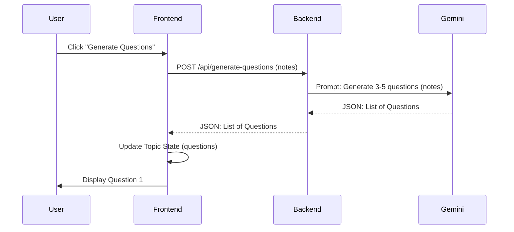

# AI Question Generator Design

## Architecture Overview

The AI Question Generator will extend the existing topic-based structure to include a list of questions. The process involves:
1. **Frontend**: Triggering generation from the topic detail view.
2. **Backend**: A new Express endpoint that prompts Gemini to generate questions from the topic's notes or script.
3. **Data**: Storing the generated questions in the local `Topic` object.

## Data Schema Updates

### Updated `Topic` Interface (in `topic-storage.ts`)

```typescript
export interface Question {
  id: string;
  text: string;
  answer?: string;
  evaluation?: Evaluation;
}

export interface Evaluation {
  status: 'correct' | 'partial' | 'incorrect' | 'pending';
  feedback: string;
}

export interface Topic {
  id: string;
  name: string;
  notes: string;
  dateCreated: string;
  aiScript?: string;
  audioFileUri?: string;
  questions?: Question[]; // NEW: List of generated questions
}
```

## API Contract

### `POST /api/generate-questions`

**Request Body:**
```json
{
  "name": "Topic Name",
  "notes": "Full topic notes...",
  "script": "AI-generated script (optional)...",
  "count": 5
}
```

**Response Body:**
```json
{
  "questions": [
    {
      "id": "uuid-1",
      "text": "Question 1 text?"
    },
    ...
  ]
}
```

## AI Prompt Strategy (System Prompt for Gemini)

> "You are a specialized learning assistant. Your task is to generate 3-5 open-ended, high-quality questions based on the provided study notes. The questions should challenge the student's understanding and encourage active recall. Return the response in a structured JSON format: { 'questions': [ { 'id': 'unique-id', 'text': '...' } ] }"

## UI Components

1. **QuestionSection**: A new component in `app/[id].tsx` to display the "Generate Questions" button.
2. **QuestionCard**: A scrollable or paginated view to show one question at a time.
3. **CycleControls**: Buttons for "Next" and "Previous" questions.

## State Management

- `generatingQuestions`: Boolean to track loading state in UI.
- `currentQuestionIndex`: Number to track the active question being viewed.
- `topic`: Local state will be updated and persisted to `AsyncStorage` via `saveTopic`.

## Sequence Diagram


