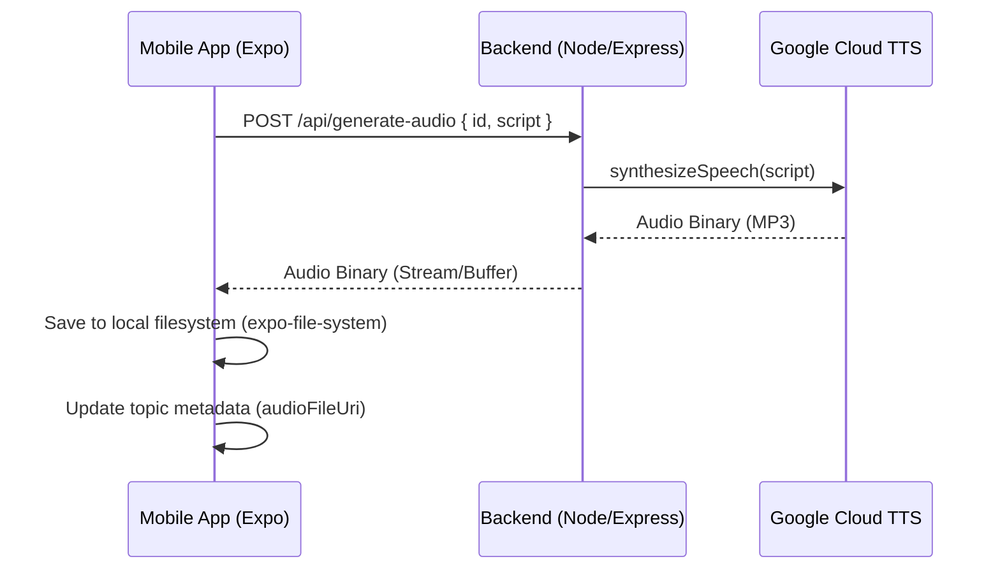

# TTS Audio Generation Design

## Overview

The TTS feature will be implemented as a new endpoint in the Node.js backend that interfaces with Google Cloud Text-to-Speech. The mobile app will call this endpoint, receive the audio binary, and save it to the local filesystem for playback.

## Architecture

## Backend Implementation

- **Library:** `@google-cloud/text-to-speech`
- **Voice:** `en-US-Journey-F` or `en-US-Wavenet-D` (High-quality, natural-sounding)
- **Audio Config:** `MP3` format, normal pitch and speed (initially).
- **Authentication:** Google Cloud Service Account (credentials required).

## Frontend Implementation

- **Library:** `expo-file-system` for saving the file.
- **Library:** `expo-av` for audio playback.
- **Trigger:** A "Generate Audio" button in `TopicDetail.tsx`.
- **Feedback:** Progress loader during generation.

## Data Storage

1. **Audio File:** Stored in the app's document directory: `FileSystem.documentDirectory + 'topics/' + topicId + '.mp3'`.
2. **Metadata:** Update the `audioFileUri` field in the topic object stored in `AsyncStorage`.

## Changes Required

### Backend
- Install `@google-cloud/text-to-speech`.
- Create `backend/src/api/generate-audio.ts`.
- Register the route in `backend/src/index.ts`.
- Configure Google Cloud credentials via environment variables.

### Frontend
- Update `TopicDetail.tsx` to include the "Generate Audio" button and playback logic.
- Update `src/storage/topic-storage.ts` if needed (it already has `audioFileUri`).
- Install `expo-file-system` and `expo-av`.
