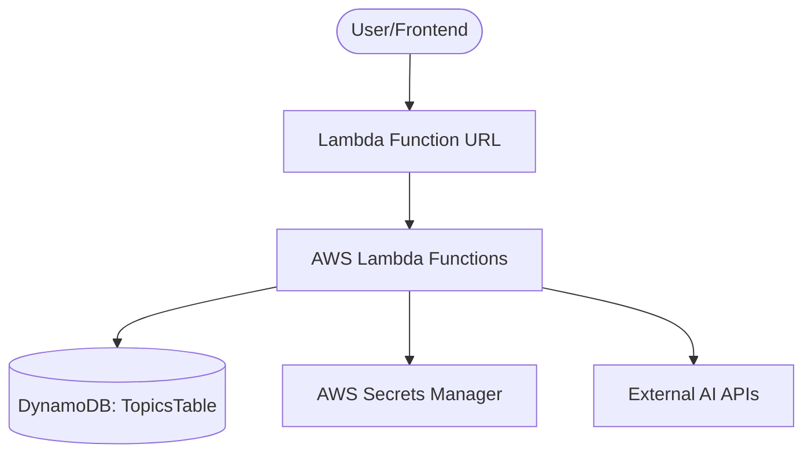

# Design: AWS Serverless Migration

## 1. System Architecture

## 2. Infrastructure (Terraform)
We will use a flat or module-based structure in a `terraform/` directory.

### Modules:
- `modules/lambda`: Handles ZIP creation, Lambda creation, and Function URL configuration.
- `modules/dynamodb`: Provisions the `Topics` table.
- `modules/iam`: Manages roles and policies (Secrets access, DynamoDB access).
- `modules/secrets`: Defines the secret placeholders (values to be filled manually or via CLI).

## 3. Data Model (DynamoDB)

**Table Name**: `Topics`

| Attribute | Type | Role | Description |
|-----------|------|------|-------------|
| `id`      | S    | PK   | Unique ID for the topic |
| `userId`  | S    | GSI1PK | For listing topics per user (if needed later) |
| `name`    | S    | -    | Topic name |
| `notes`   | S    | -    | Raw notes |
| `script`  | S    | -    | AI Generated script |
| `questions`| L   | -    | List of generated questions |
| `createdAt`| N   | -    | Timestamp |

## 4. Lambda Refactoring Strategy
Since we are using **One Lambda per Route**, we will refactor the existing code in `backend/src/api/`.

### Transformation:
- **Current**: `(req: Request, res: Response) => { ... }` (Express)
- **New**: `(event: APIGatewayProxyEvent): Promise<APIGatewayProxyResult> => { ... }`

### Shared Logic:
Move common AI logic and configuration fetching to `backend/src/lib/`.
- Secrets will be fetched once per container lifecycle (outside the handler) to minimize latency.

## 5. Deployment Workflow
1. `npm run build` (Transpile TS to JS).
2. `terraform plan` (Verify infrastructure changes).
3. `terraform apply` (Deploy).

## 6. Implementation Stages
1. **Infrastructure**: Set up Terraform for DynamoDB and Secrets Manager.
2. **Refactor**: Create Lambda handlers for each endpoint.
3. **IAM**: Configure Lambda execution roles with least-privilege.
4. **Integration**: Connect Frontend to the new Function URLs.
