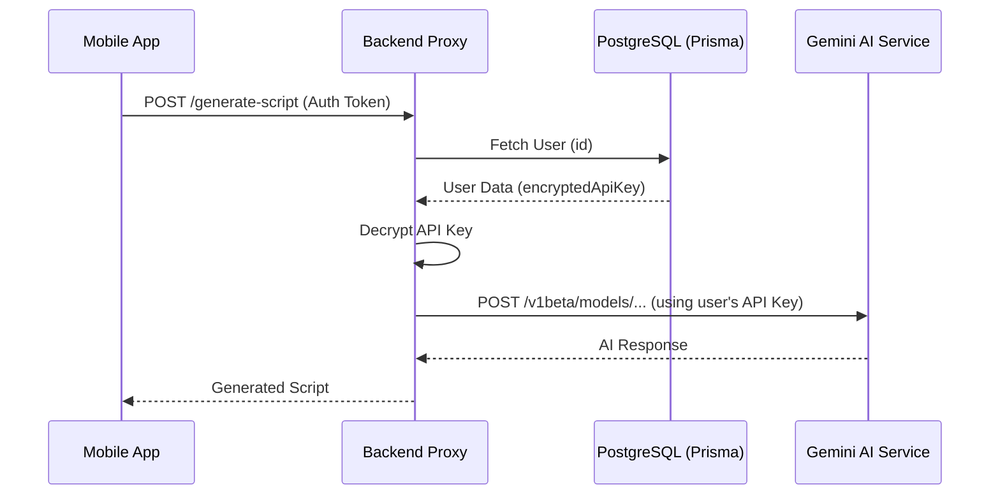

# Configuration & API Key Management Design

## Architecture Overview

The configuration system will be deeply integrated with the `AuthContext` and the backend proxy. Instead of relying on environment variables for the Gemini API key, the backend will fetch the user's specific key from the database, decrypt it, and use it for the request.

## Backend Design

### Prisma Schema Update
Add optional configuration fields to the `User` model.
```prisma
model User {
  // ... existing fields
  geminiApiKey     String?   // Encrypted
  selectedAiModel  String?   @default("gemini-1.5-flash")
  audioProvider    String?   @default("google-tts")
}
```

### Security Layer (Node.js)
A utility service will handle encryption/decryption using a system-level secret (e.g., `AES_ENCRYPTION_KEY`).

```typescript
// Example encryption logic
function encryptKey(key: string): string;
function decryptKey(encryptedKey: string): string;
```

### API Endpoints
- `GET /api/user/config`: Returns `selectedAiModel`, `audioProvider`, and a masked `geminiApiKey` (e.g., `**********XyZ`).
- `PATCH /api/user/config`: Updates the user's configuration.

## Frontend Design

### Navigation
- Add `app/config.tsx` route.
- Update `app/_layout.tsx` to include the `config` screen.
- Update `app/index.tsx` header with a `TouchableOpacity` containing a gear icon (or text label "Configs" for v1).

### Config Screen UI
- A simple form with:
  - Text input for the Gemini API Key (secure text entry).
  - (v2) Dropdown/Picker for AI Models.
  - (v2) Dropdown/Picker for Audio Providers.
  - "Save Changes" button.

### Logic Flow
1. `ConfigScreen` mounts.
2. Fetch current config from `/api/user/config`.
3. User enters new key.
4. `onSave` calls `PATCH /api/user/config` with the raw key.
5. Backend encrypts and saves to DB.

## Data Flow Diagram (Mermaid)


