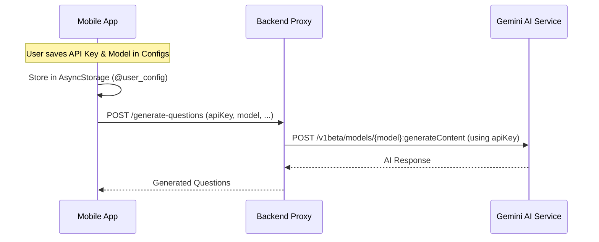

# Configuration & API Key Management Design

## Architecture Overview (v1 - Local Storage)

The configuration system currently relies on `AsyncStorage` on the mobile client. When making AI requests, the client fetches the stored configuration and sends the necessary parameters (API key, selected model) to the backend.

## Frontend Design

### Global Navigation
- **Header Gear Icon**: Update `app/_layout.tsx` to include a `headerRight` component in `screenOptions`. This component will be a `TouchableOpacity` with a `MaterialCommunityIcons` gear icon, navigating to `/config`.

### Config Screen UI (`app/config.tsx`)
- **API Key Section**: Existing masked key display and input for updates.
- **Model Selection Section**: 
  - A dropdown (using a simple `Modal` or a picker-like implementation) to select the Gemini model.
  - Models: `gemini-1.5-flash`, `gemini-1.5-pro`, `gemini-2.0-flash`.
- **Save Action**: Saves both `geminiApiKey` and `selectedModel` to `AsyncStorage` under `@user_config`.

### Storage Update (`src/storage/topic-storage.ts`)
- Update `UserConfig` interface:
  ```typescript
  export interface UserConfig {
    geminiApiKey?: string;
    selectedModel?: string; // Default: 'gemini-1.5-flash'
  }
  ```

## Backend Design

### API Schemas (`backend/src/schemas/api-schemas.ts`)
- Update `generateScriptSchema`, `generateQuestionsSchema`, and `evaluateAnswerSchema` to include an optional `model` string field in the body.

### API Logic
- Update `generateScript.ts`, `generateQuestions.ts`, and `evaluateAnswer.ts` to:
  1. Extract `model` from `req.body`.
  2. Fallback to a default model if not provided (e.g., `gemini-1.5-flash`).
  3. Pass the model name to `genAI.getGenerativeModel({ model: selectedModel })`.

## Data Flow Diagram (Mermaid)


```mermaid
sequenceDiagram
    participant App as Mobile App
    participant API as Backend Proxy
    participant AI as Gemini AI Service

    Note over App: User saves API Key & Model in Configs
    App->>App: Store in AsyncStorage (@user_config)
    
    App->>API: POST /generate-questions (apiKey, model, ...)
    API->>AI: POST /v1beta/models/{model}:generateContent (using apiKey)
    AI-->>API: AI Response
    API-->>App: Generated Questions
```
