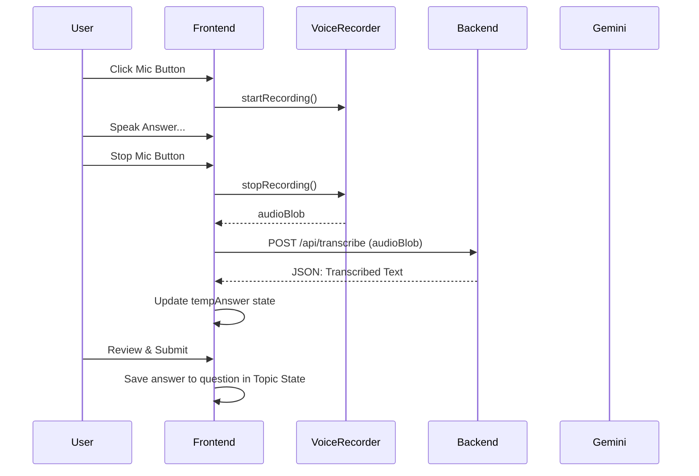

# Interactive Responses Design

## Architecture Overview

The Interactive Responses feature will enable users to provide text or voice answers to the generated questions. It will leverage the existing STT (Speech-to-Text) infrastructure.

## Data Schema Updates

The `Question` and `Topic` interface updates are covered in the `AI Question Generator` design. This feature focuses on the `answer` field within the `Question` object.

```typescript
export interface Question {
  id: string;
  text: string;
  answer?: string; // NEW: The user's text or transcribed answer
  evaluation?: Evaluation;
}
```

## Voice-to-Text Integration

1. **Frontend**: The `voice-recorder.ts` utility will capture the user's spoken answer.
2. **Backend**: The `/api/transcribe` endpoint (already existing) will convert the audio blob into text.
3. **Frontend**: The transcribed text will be placed in the input field for the user to review/edit.

## UI Components

1. **AnswerInputField**: A `TextInput` for the user to type or edit their answer.
2. **MicrophoneButton**: A button (similar to the one in the `Create` view) to record voice answers.
3. **SubmitAnswerButton**: A button to save the current answer to the question in `AsyncStorage`.

## State Management

- `recordingAnswer`: Boolean to track if the mic is active.
- `tempAnswer`: Local state for the text input while typing/transcribing.
- `isAnswered`: Derived state based on whether `question.answer` is present.

## Sequence Diagram (Voice Answer)


