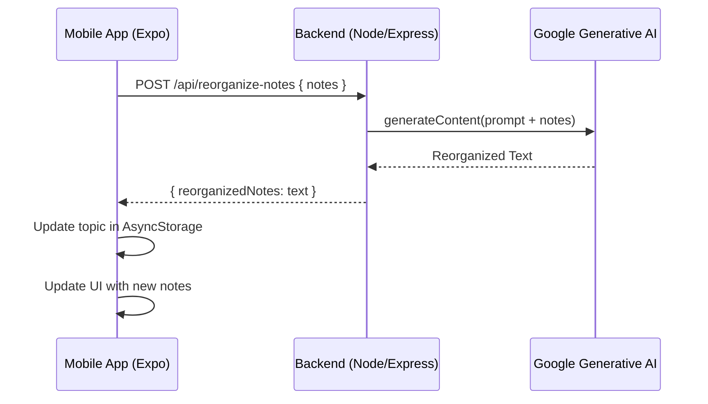

# Note Reorganization Design

## Overview

The Note Reorganization feature will be implemented as a new endpoint in the Node.js backend using the Google Generative AI (Gemini) SDK. The mobile app will call this endpoint with the current notes, receive the reorganized text, and update the topic locally.

## Architecture



## Backend Implementation

- **Endpoint:** `/api/reorganize-notes`
- **Library:** `@google-generative-ai`
- **Model:** `gemini-1.5-flash` (Fast and cost-effective)
- **Prompt:** 
  ```text
  You are an expert editor specializing in note organization. 
  Your task is to take a set of study notes, which may be messy or transcribed from voice, and reorganize them.
  
  GUIDELINES:
  - Remove any duplicate information.
  - Fix grammatical errors and improve flow.
  - Organize the content into a logical structure (use bullet points or clear paragraphs).
  - Ensure all key information from the original notes is preserved.
  - Do NOT add external information; stick strictly to what is provided.
  - The output should be clean and ready for script generation.
  
  ORIGINAL NOTES:
  ${notes}
  ```

## Frontend Implementation

- **Trigger:** A button labeled "ORGANIZE NOTES" located near the "Notes" section in `TopicDetail.tsx`.
- **Feedback:** Replace the notes with an `ActivityIndicator` or show a loading state while waiting.
- **Update Logic:**
  - Call the API.
  - Receive the new text.
  - Call `saveTopic` with the updated notes.
  - Update the local state to reflect the change.

## Changes Required

### Backend
- Create `backend/src/api/reorganize-notes.ts`.
- Register the route in `backend/src/routes.ts` (or `index.ts` depending on existing structure).

### Frontend
- Update `frontend/app/[id].tsx` to include the "ORGANIZE NOTES" button.
- Add `handleReorganizeNotes` function to perform the API call and update storage.
- Update `TopicDetail` UI to handle the loading state during reorganization.
